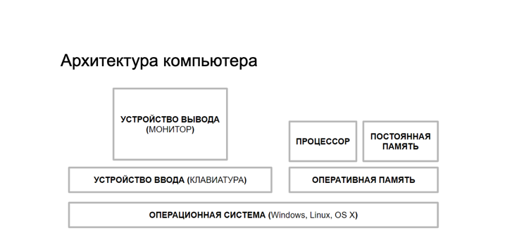

# Материал сегодняшнего занятия:

## Вводная часть:

1. Правила проведения занятий:
   1. Политика и религия - табу (строго запрещено!)
   2. **Всегда лучше спросить, чем промолчать!**
   3. Фото + Имя Фамилия в Slack и Zoom
   4. На консультацию приходим с вопросами и "заделами по коду"
   5. ДЗ присылаем в личный канал преподавателя в Slack
   6. Все материалы занятий находятся по адресу: https://lms.ait-tr.de/#/lessons/group/cohort42.3/module/basic_programming/lesson/lesson_01 и далее выбираем номер занятия.
   7. Записи занятий будут доступны, НО это на случай пропуска занятия. "Я потом пересмотрю и всех догоню" - это плохая практика!
   8. Занятие начинаем не позже 18:35, тайминг занятия - 2 перерыва по 15 мину
   9. Учимся НЕ НА СКОРОСТЬ, а НА ПОНИМАНИЕ, учимся за знания, а не за оценки.
   10. Юмор и самокритика приветствуются.

2. Работа с компьютером на занятии:
- писать код на занятии за (вместе с) преподавателем - это на 95% обязательно, это часть методики обучения, 5% - это исключения из общей практики.
- можно слушать с телефона или планшета, НО НЕ НА ДИВАНЕ!, и не отвлекаясь от того, что происходит на уроке.
- надо быть готовыми в любой момент показать свой экран и получить помощь от преподавателя и коллег
- камеру не включаем, НО микрофоном пользуемся;
- НАКЛЕЙКИ с русскими буквами - строго рекомендуется.

3. Самостоятельная работа между занятиями (aka "домашка"):
- является практически обязательным элементом обучения;
- требует в 2-3 раза больше времени, чем вы на нее планируете;
- приветствуется совместная работа, дележка кодом, главное - сделать ваш вариант, который у вас работает;
- текст (код) присылается в личный канал преподавателю на проверку в Slack;
- ВАЖНО!!!: вовремя вставать, делать перерывы на 15-20 минут, НЕ СИДЕТЬ ДО ___ ЧАСОВ НОЧИ! Это бесполезная трата времени. Лучше выспаться, спросить, получить консультацию, взять пример кода и т.д.
- ChatGPT - приветствуется! Лучше решить задачу c применением AI, чем не решать вовсе.
- куда складывать свою работу? - в отдельную легко доступную папку на компьютере.

4. Знакомство (прислать в канал в Slack - общий или личный):
- меня зовут ...Леонид
- я живу в городе ...Аугсбург, Бавария с 2022 года
- у меня высшее образование (3 шт.)
- по профессии я преподаватель, менеджер проектов в ИТ
- работаю (или работал) я преподавателем программирования
- мое желание стать программистом или специалистом в области ИТ составляет ____ (по шкале от 1 до 10)

Какими **важными профессиональным качествами и навыками** обладает программист:
      1. Быстро печать на клавиатуре
      2. Английский язык в минимуме (500 слов)
      3. Находить быстро ответы на вопросы
      
      Способность обучаться новому
        НЕ ЗАБЫВАТЬ И НЕ ТЕРЯТЬ СВОМ ПАРОЛИ
      Любопытсво
      Трудоспособность, целеустремленность
      Дисциплина, САМОдисциплина, таймменедженте
      Внимательность
      Ответственность
      Аналитическое мышление
      Структурировать, не валить в кучу
      Коммуникабельность (soft skills)
      Умение работать команде
      Усидчивость
      "Светлая" голова

Что вам будет сильно мешать стать хорошим программистом?
      шум и гам вокруг
      звонки по телефону
      лень

------------------------------------------------------------

## Что мы узнаем сегодня на занятии?

1. Компьютер - RAM(ОЗУ) - HDD/SSD - периферия - Программное обеспечение
RAM = **Оперативная память** = ОЗУ  - пропадает после выключения
HDD/SSD = жесткая, **долгосрочная память** - не пропадает при выключении

2. Директории (папки), файлы = имя + расширение (указывается через точку)

   report.doc - для программы Word
   text.txt
    pic2024.img, 123908.jpg - картинки
    Car.java - програма на языке Java

      Как их называть? - Единообразно! - это главное. И надо помнить свою структуру папок.

      И не забывать ПАРОЛИ!!!, там, где они будут нужны.

3. Языки программирования вообще, понятие "компилятор".
Java - старт в 1995 году, компилятор JAVAC получает на вход **текст** и превращает его бинарный код (исполняемые команды для компьютера).
А дальше этот код передается на исполнение в JVM - работает на любой ОС.
   Концепция Java - что JVM внутри любого "устройства".

4. Что такое Java Development Kit (JDK от 17 версии и более)- набор ПО для разработки программ.

5. Что такое Integrated Development Environment? Установка IntelliJ IDEA.

6. Начало работы в IDE, создание первого проекта.

7. Осваиваем вывод информации (текста) в консоль, пишем программу "Hello, World!"

8. Как напечатать что-то еще?

9. Домашнее задание.

